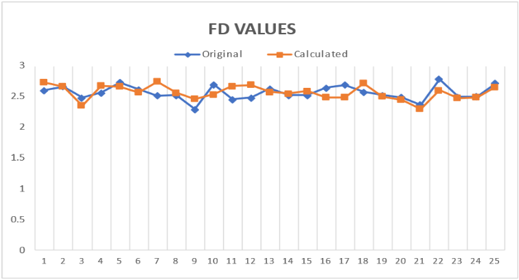

# Fractal-Analysis-by-Differential-Box-Counting

## Introduction
This project focuses on the development and implementation of a novel algorithm based on fractal dimension analysis for medical image processing. Our goal is to enhance the efficiency and accuracy of image analysis in the domain of medical diagnostics by quantifying the fractal dimension of images from CT, PET, and MRI scans.

Fractal geometry, renowned for its ability to characterize complex structures, serves as the theoretical foundation for our algorithm. By quantifying the fractal dimension of images, we aim to extract meaningful features indicative of underlying tissue characteristics. The algorithm's primary objective is to provide a quantitative measure of image complexity, enabling healthcare professionals to assess subtle variations in tissue texture and morphology.

## Fractal Dimension
- Measures the complexity of a figure
- A fractional number
- More FD means a more complex figure
- Similar FD means similar images
- Images can be segmented and saved based on fractal dimension, reducing storage complexity
- Applicable to fluid flow images
- Many ways to estimate; we used Box Counting

## Algorithm Reference
Our algorithm is primarily based on the “Differential Box Counting Algorithm” proposed by B. B. Chaudhari and Nirupam Sarkar.

## The Differential Box Counting Algorithm
In 1992, Sarkar et al. proposed a straightforward approach for estimating the fractal dimension (FD) of a grayscale image. Their methodology involves partitioning a square image (I) of size M×M pixels into non-overlapping grids of size s×s pixels, where s is an integer ranging from 2 to M/2. The scale (r) of a grid with size s×s pixels relative to the image size M is defined as r = s/M. If s is not a divisor of M, then the non-image pixels on the boundary of the grids are treated as zero.

Within each grid, multiple boxes of size s×s×h are utilized to cover the rough gray-level image intensity surface. These boxes are assigned numerical values according to a specific scheme. Here, ⌊.⌋ denotes the floor function, and it is used to determine the number of boxes needed to cover the intensity surface, denoted by ⌊G/h⌋ = ⌊M/s⌋, which implies h = s × G/M.

This approach provides a systematic framework for computing the fractal dimension of an image, enabling the quantification of its complexity and texture. By iteratively adjusting the grid size and analyzing the distribution of intensity values within each grid, Sarkar et al.'s method facilitates the estimation of the fractal dimension, offering valuable insights into the structural properties of the image.

Reference: [MDPI Paper](https://www.mdpi.com/1099-4300/19/10/534)

## Validation using Brodatz dataset
We experimented with our algorithm on some sample images from the publicly available Brodatz Database, which contains 112 textured images of size 640×640 pixels. This database is popular and widely used by researchers in this context.

So far, we have experimented on 25 images from the Brodatz dataset and 4 images of multiphase flow.

[Colab Notebook for reference](Box_counting_BBC.ipynb)

## Results

Here is the graph between original values and values of FD calculated by our algorithm based on 25 images of the Brodatz dataset.

[CSV of our results](https://docs.google.com/spreadsheets/d/1MYCr4n0EcmILWbQOUcD5jKj_nC8A9qnDLgJvZmwuRrw/edit#gid=0)

## Progress of our Project
- Devised an algorithm to convert an image into a matrix
- Implemented the algorithm used in phase flow diagram to calculate fractal dimension
- Able to segregate the images to some extent based on our algorithm but it still needs to be reviewed for precision
- Yet to train the AI model for concluding our project which we have decided to do in the summer

## Possible Improvements
- Resize all images to 256×256, which might cause information loss for larger images and incorrect info for smaller images
- Some figures gave error > 10%, we could try changing parameters to possibly reduce this
- Our method works only for 3D images
- Different formulas have been proposed to calculate h, we could try different variations
- Currently, taking G=M=256 which gives h=s always. We could try varying the values of G and M

## Future Prospects
The project has the potential to revolutionize cancer detection by introducing a novel approach that combines fractal geometry and machine learning. By providing automated and objective analysis of medical images, this approach can enhance diagnostic accuracy, improve patient outcomes, and streamline clinical workflows. We aim to train an AI model for the same after validating our algorithm on a greater dataset.

Special thanks to Prof. Prabhat Munshi, Pridhi Athe, and Nehlata Shakhya.

## Authors
- Asmi Srivastava 
- Purvanshi Nijhawan 
- Shubham Gupta 
- Sohit Dhawan
